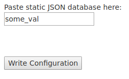

Ez Configuration
================

.. note::

  The URL of the config interface (ICE) for a module is: jsonsails.com/module/<module_id>/config

Module configuration is designed at the root node, and for a reference module
the config GUI is exposed through the refmod node.

.. _`refnode-config-script`:

Config Script
^^^^^^^^^^^^^

The main namespaces here are 

* js.ConfigApi 
* js.config

Cursory examples of API:

.. code-block:: javascript

    // Label 
    js.ConfigApi.addLabel("Paste static JSON database here:")
    
    // Small text input
    js.ConfigApi.addInput(js.config.field_name, function(val){
      js.config.field_name = val;
    })

    // Large text area
    js.ConfigApi.addText(js.config.db_name, function(val){
      js.config.db_name = val;
    })    

    // Add plus area
    var params = {
      "initial":js.config.field_name.map((tok)=>{JSON.stringify(tok)}),
      "validate":function(val){return val.hasOwnProperty('answer')},
      "callback":function(val){js.config.field_name = JSON.parse(val)},
      "info":"<h3>Instructions</h3>",
      "limit":2,
    }
    js.ConfigApi.addPlusArea(params)    

Deeper example for plus area

.. code-block:: javascript

    var initial = []
    if(Object.prototype.toString.call(js.config.options) === "[object Array]"){
        initial = js.config.options
    }

    var dfault = {"hi":7}
    function validate_obj(obj){
        //console.log('trying', JSON.stringify(obj, null, 2))
        var ret = true
        if(Object.prototype.toString.call(obj) !== "[object Object]"  )  
            ret = false
        if(!obj.hasOwnProperty('hi'))
            ret = false
        return ret
    }
    function deserialize(str){
        try{
            return JSON.parse(str)
        }catch(e){
            alert("Problem deserializing")
        }    
    }

    var params = {};
    params.validate = function(str){ 
        var obj = deserialize(str)
        return validate_obj(obj)
    }
    params.initial = initial.map((tok)=>{ 
        if(validate_obj(tok)){
            return JSON.stringify(tok, null, 2)
        }else{
            return JSON.stringify(dfault, null, 2)
        }
    })
    params.callback = function(vals){
        js.config.options = vals.map((tok)=>{return deserialize(tok)})
    }
    params.info = "<b>this</b> is how to do it";
    params.limit = 1

    js.ConfigApi.addPlusArea(params)

.. _`refnode-config-gui`:

Config GUI
^^^^^^^^^^

This is the configuration GUI, created by the config script, to set 
properties of the config JSON. 

.. _`refnode-config-json`:

Config JSON
^^^^^^^^^^^

The config is JSON data structure which is accessible in module JS context.

.. code-block:: json

    {
      "field_name": "some val"
    }

