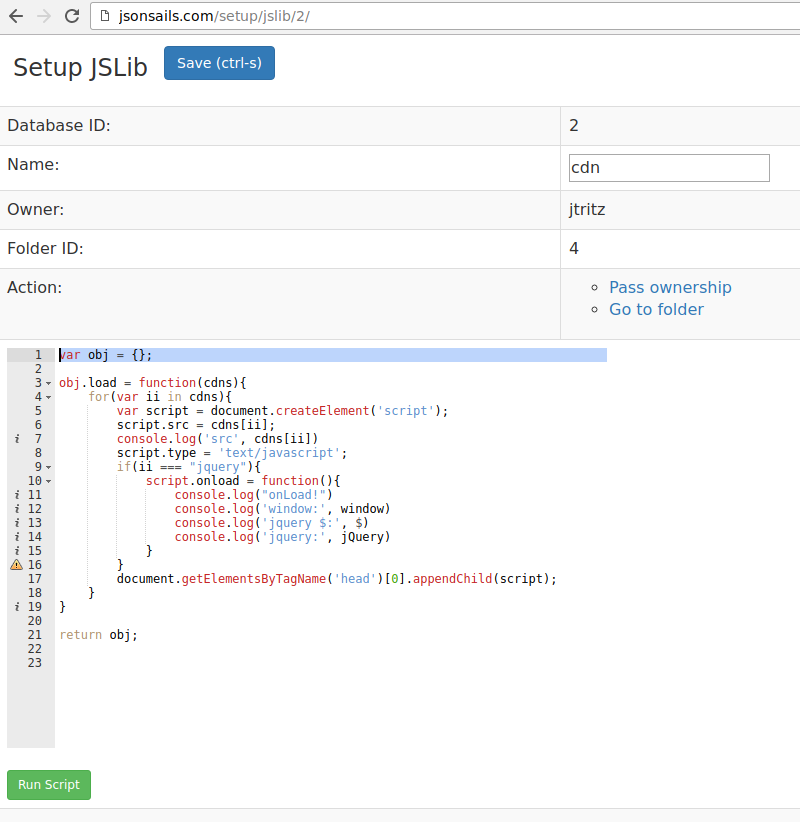

.. _`script-jslibs`:

JSLib Script
============

The script is edited on the JSLib setup page, and the return value should be an
object.  The object which will be accessed in the including environment under
the alias which it is given on the including setup page.

Script example
^^^^^^^^^^^^^^

.. code-block:: javascript

    var obj = {}; 
    obj.say_hello = function(name){ alert('hello ' + name); }
    return obj

Screenshot
^^^^^^^^^^

